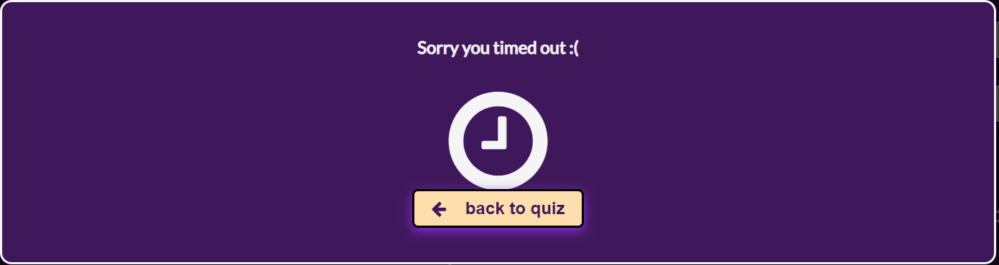

# Portfolio Project 2 - Javascript

The Premier League Quiz is a sports quiz site that aimed at football fans to test their knowledge and bring back memories of past football folklore. This Quiz will have 8 multiple choice question with a 90- second timer and leaderboard so you can compete with friends and family about your score.

## Key Project Goals
This project has 2 main objectives: 
- To showcase the development of my HTML and CSS skills as this is my second portfolio project.
- To integrate Javascript with HTML and CSS to create a quiz that is functional and interactive.
- To create a fun quiz for football fans. The site should be easily accesed from all types on devices.
- To enable players remince of the football players have watched over the years through a fun and comepititve game.

# Brief
The quiz should be engaging and have a variety of questions that tests and challenges players knowledge of football. 

## Target Audience
Sports fans, football fans

# UX user Experience

## First Time Visitor Goals
- As a first-time visitor, I would like to understand the website's objective and purpose.
- As a first time visitor, I would like to be able to navigate through the website easily and without any problems.
- As a first time visitor, I would like to understand how to play quiz and be able to easilu interputs its rules.

## Returning User Goals
- As a returning visitor, I would like to see new and more questions.
- As a returning visitorr, I would like to be able to leave feedback and suggestions for future questions for the quiz.
- As a returning visitor, I would like to get in touch with the site developer

## Frequent User Goals
- As a frequent user, I would like to see my best scores.
- As a frequent user, I would like to see if any questions suggested by other users were used as new questions.
- As a frequent user, I would like to sign up to be notified to any changes and updates to the quiz.

### Initial Concept
To gain ideas for the general design of the quiz i gathered inspiration from fellow students in code insitutes project that was obtained from the peer review channel on slack. An example of a site i took inspiration from would be [Sean Johnstons quiz] (https://github.com/seanf316/P2-Movie-Buff-Or-Bluff)

### Wireframes
The Wireframes were produced using [Balsamiq](https://balsamiq.com/). 
The final site varies from the wireframes due to developments that occurred during the building process. 

### Features Left to Implement
As a future enhancement, I would like to add a scoreboard tracker into the quiz.

### Colour Scheme
The color scheme used on this website was based on the hero image. [Coolors.co](https://coolors.co/) was used to identify the colours associated with the hero imahge. This identified a selction of 5 colours. The quiz is predominantly based on only of these colours Russian Violet. The color white was chosen to provide a nice contrast to the site and was used as the main colour for the text of the site. Ultraviolet was as the box shadow effect around the buttons of the site.

### Typography
Google fonts was used to import the fonts used for the purpose of this quiz [google fonts](https://fonts.google.com/).
The use of these fonts togetheir was inspired by [Elementor.com](https://elementor.com/blog/font-pairing/#). This font provided a sharp and professional look for the quiz.

## Features
### Homepage  

- The homepage is the landing page which introduces the user to the website.The homepage is split into 3 sections. Firstly,at the top their is a clear title stating that the purpose of the website is a quiz. This section also contains a hero image that zooms to when a user lands on the page to set a playful tone for the quiz. 

### Instructions and lets get started button
- The second section provides users 2 options to proceed on the homepage. This is the intructions button which provides users clarity on how to play the game and a let get started button to start the game. The lets get starte button is also styled with a icon.

### Sign up and footer
 - At the bottom of the landing page there is a sign up form. This enablses users to enter their information to subscripe for future quiz updates as well as the opporunity to provide some feedback on the quiz. There is also a footer that provides social media links to the quiz.

 
 
 
#### Name input

- On game start the users are shown an input box with the label "Enter your username"
- Users are unable to proceed without entering a username

 

 ### Main Quiz Section
  
  The main quiz section  includes the username name along with a greeting , a timer, the question, 4 answer buttons and a next button

   - Question
    
      The question is displayed at the top of the section above to question to ensure it is clearly visible to users.
       

  - Timer
  
  - The question is displayed at the top of the section above the question and will turn red when there is less than 15 seconds remaining. 
    This will warn users time is running out.
      

  - When the timer is done a pop up modal will display redirect user back to the homepage to enable them to play again

      

- Answer buttons

  - The answer buttons are displayed in in 2 rows with 2 buttons per row. 

  

  - For smaller mobile phone devices the questions are displayed in a column of 4.
  - The answer buttons change color to red or green to demonstrate to the user if their correc was right or wrong. 

    

- Next Button 

- The next button enables the user to move on to the next question. It is disabled until a user selects an answer.

- Progress bar 

  - The progess fills as the user progresses through the quiz. This enables the user to know how much of the quiz is left

- Social media links

  - The social media links enable the user to vist the quizs social media pages to find out more information.

 ### Results page 
  - The results shows users their score from the quiz.
  - Users are awarded a trophy depending on their score.
  - The users can see their score as a percentage and receive a personalised messege depending on their score.
  - When the user achieves a score above 75% they are awarded a gold trophy icon.

 

  - When the user achieves a score above 50%  but less than 75 %they are awarded a silver trophy icon.

 
 
  - When the user achieves a score above 50% they are awarded a bronze trophy icon.
 
  - The user is then redirected back to the homepage.

  

  ### 404 page

   -  The site has a custom 404 page that tells the user that something went wrong and also includes a home button to take the user back to the main quiz menu.
   
 
## Testing 

### Validator Testing 
- No errors were shown when putting the code through the w3c html validator.

   - Index.html validation
   
 
  
   - 404 Page validation
    

- No errors were shown when putting the code through the jigsaw css validator.

  

  

      
       

